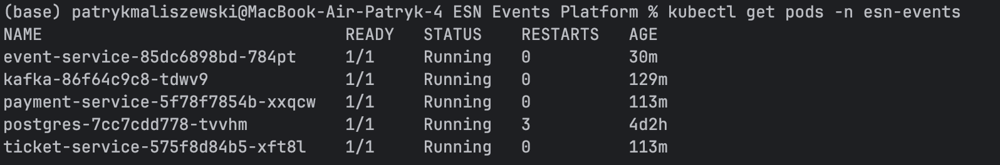
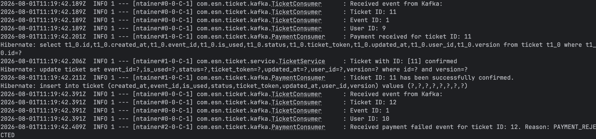

# 🎟️ ESN Events Platform

A Kubernetes-deployed, event-driven microservices platform built with Spring Boot, Apache Kafka, PostgreSQL and Docker.

---

## 📑 Table of Contents

- [📝 Description](#description)
    - [Overview](#overview)
    - [Key Features](#features)
- [🏗️ Architecture](#architecture)
- [🎯 Business Workflow](#workflow)
- [🔧 Technologies](#technologies)
- [📡 API Endpoints](#endpoints)
- [📸 Screenshots](#screenshots)
- [✅ Testing](#testing)
- [🐳 Docker Setup](#docker)
- [🚀 How to Run](#run)
- [📋 Future Improvements](#todo)

---

# <a name="description"></a> 📝 Description

## <a name="overview"></a> Overview

ESN Events Platform is a microservices-based event management and ticketing system inspired by the needs of student organisations such as Erasmus Student Network (ESN).

The platform allows organisers to create events, manage ticket reservations, process payments and notify participants about important updates.

The main goal of this project was to gain hands-on experience with:

- Microservices architecture
- Event-driven communication
- Apache Kafka
- Business workflow modelling

Communication between services is performed asynchronously using Kafka, allowing services to remain loosely coupled and independently deployable.

---

## <a name="features"></a> ✨ Key Features

### 🎉 Event Management

- Create free and paid events
- Configure event capacity
- Update event prices
- Generate financial reports
- Prevent overbooking using optimistic locking

### 🎫 Ticket Management

- Reserve seats for participants
- Automatic reservation expiration after 15 minutes if payment is not completed
- Generate unique ticket tokens after successful payment
- Validate tickets during event entry
- Prevent duplicate ticket usage

### 💳 Payment Processing

- Asynchronous payment workflow using Kafka
- Event-based communication between services
- Ready for future payment provider integration
- Payment confirmation and cancellation flows

### 🔔 Notifications

- Reservation confirmation notifications
- Payment success notifications
- Event-driven notification delivery

---

# <a name="architecture"></a> 🏗️ Architecture

The platform consists of four independent Spring Boot microservices:

| Service | Responsibility |
|----------|----------|
| Event Service | Event management and financial reporting |
| Ticket Service | Ticket lifecycle management |
| Payment Service | Payment processing workflow |
| Notification Service | Sending participant notifications |

---

# <a name="workflow"></a> 🎯 Business Workflow

The following workflow demonstrates the complete ticket lifecycle:

```text
Create Ticket
      |
      v
PENDING
      |
      +----------------+
      |                |
      v                v

Payment OK      Payment Failed

      |                |
      v                v

CONFIRMED      CANCELLED

      |
      v

QR Validation

      |
      v

USED
```

### Reservation Timeout

A scheduled job automatically checks for unpaid reservations.

```text
Ticket Created
      |
      v

PENDING (15 min)

      |
      v

Reservation Timeout

      |
      v

CANCELLED
```

This prevents seats from being blocked indefinitely.

---

# <a name="technologies"></a> 🔧 Technologies

## 🚀 Backend

- Java 21
- Spring Boot
- Spring Data JPA
- Hibernate

## 📨 Event Streaming

- Apache Kafka

## 🗄️ Database

- PostgreSQL

## ☸️ Infrastructure

- Docker
- Kubernetes

## 🧪 Testing

- JUnit 5
- Mockito

## 🛠️ Build Tools

- Maven

---

# <a name="endpoints"></a> 📡 API Endpoints

## Event Service

| Method | Endpoint | Description |
|----------|----------|----------|
| POST | `/events` | Create event |
| GET | `/events` | Get all events |
| GET | `/events/{id}` | Get event by ID |
| GET | `/events/{id}/finances` | Financial report |
| PATCH | `/events/{id}/price` | Update event price |

---

## Ticket Service

| Method | Endpoint | Description |
|----------|----------|----------|
| POST | `/tickets` | Create ticket |
| GET | `/tickets/by-event/{eventId}` | Get tickets by event |
| PUT | `/tickets/validate` | Validate ticket |

---

## Payment Service

Payment processing is currently triggered via Kafka events.

```text
TicketCreatedEvent
        ↓
Payment Service
        ↓
PaymentSuccessEvent / PaymentFailedEvent
```

> Note: Payments are currently mocked for demonstration purposes. In a production environment this service would integrate with a real payment provider such as Stripe or PayPal.

---

## Notification Service

Consumes Kafka events:

```text
ticket-created-topic

payment-success-topic

ticket-cancelled-topic
```

and sends corresponding notifications.

---

# <a name="screenshots"></a> 📸 Screenshots

## 🏗️ Architecture Diagram


---

## ☸️ Kubernetes Deployment



The deployment includes:

- Event Service
- Ticket Service
- Payment Service
- PostgreSQL
- Apache Kafka (KRaft)

The services communicate internally through Kubernetes Services and ConfigMaps.

---

## 📨 Event-Driven Workflow (Apache Kafka)



The screenshot presents the complete workflow:

1. Ticket Service publishes `TicketCreatedEvent`
2. Payment Service consumes the event
3. Payment result is published as:
    - `PaymentSuccessEvent`
    - `PaymentFailedEvent`
4. Ticket Service consumes the payment result
5. Ticket status is automatically updated:
    - `CONFIRMED`
    - `CANCELLED`

This demonstrates an event-driven architecture where services communicate asynchronously without direct REST calls.

---

## 🎯 Ticket Lifecycle Workflow


---

## 📡 Swagger - Event Service


---

## 🎫 Swagger - Ticket Service


---

# <a name="testing"></a> ✅ Testing

The project contains unit tests written with JUnit 5 & Mockito

Current test coverage includes:

### Event Service

- Event creation
- Seat reservation
- Capacity validation
- Financial reporting

### Ticket Service

- Ticket creation
- Ticket confirmation
- Ticket cancellation
- Ticket validation
- Reservation expiration scheduler

### Notification Service

- Kafka consumer processing
- Notification delivery flow

### Payment Service

- Payment event processing
- Kafka producer verification

---

# <a name="docker"></a> 🐳 Docker Setup

The project is designed to run using Docker containers.

Infrastructure services:

```text
PostgreSQL
Apache Kafka
```

Application services:

```text
event-service
ticket-service
payment-service
notification-service
```

---

# <a name="run"></a> 🚀 How to Run

The project supports two deployment options:

- Docker Compose (local development)
- Kubernetes (recommended)

---

## 🐳 Option 1 - Docker Compose

### 1. Clone Repository

```bash
git clone https://github.com/patryk47853/ESN-Events-Platform
```

### 2. Start Infrastructure

```bash
docker-compose up -d
```

This will start:

```text
PostgreSQL
Apache Kafka
```

### 3. Run Microservices

Start each service separately:

```bash
mvn spring-boot:run
```

for:

```text
event-service
ticket-service
payment-service
notification-service
```

---

## ☸️ Option 2 - Kubernetes Deployment (Recommended)

### Build Docker Images

```bash
mvn clean package
```

```bash
docker build -t esn-event-service:0.1 event-service
docker build -t esn-ticket-service:0.1 ticket-service
docker build -t esn-payment-service:0.1 payment-service
docker build -t esn-notification-service:0.1 notification-service
```

### Deploy Infrastructure

```bash
kubectl apply -f k8s/postgres
kubectl apply -f k8s/kafka
```

### Deploy Microservices

```bash
kubectl apply -f k8s/event-service
kubectl apply -f k8s/ticket-service
kubectl apply -f k8s/payment-service
kubectl apply -f k8s/notification-service
```

### Verify Deployment

```bash
kubectl get pods -n esn-events
```

Expected result:

```text
event-service         Running
ticket-service        Running
payment-service       Running
notification-service  Running
postgres              Running
kafka                 Running
```

---

## Service Ports

| Service | Port |
|----------|----------|
| Event Service | 8081 |
| Ticket Service | 8082 |
| Notification Service | 8083 |
| Payment Service | 8084 |

---

## Example Event-Driven Workflow

```text
Client
  │
  ▼
Ticket Service
  │
  ▼
TicketCreatedEvent
  │
  ▼
Apache Kafka
  │
  ▼
Payment Service
  │
  ├── PaymentSuccessEvent
  │
  └── PaymentFailedEvent
         │
         ▼
Apache Kafka
         │
         ▼
Ticket Service
         │
         ▼
CONFIRMED / CANCELLED
```

Business flow:

1. Create an event
2. Create a ticket reservation
3. Ticket status becomes `PENDING`
4. `TicketCreatedEvent` is published to Kafka
5. Payment Service processes the event
6. Payment Service publishes:
    - `PaymentSuccessEvent`
    - `PaymentFailedEvent`
7. Ticket Service updates ticket status:
    - `CONFIRMED`
    - `CANCELLED`
8. Confirmed tickets receive unique ticket tokens
9. Tickets can be validated during event entry

---

# <a name="todo"></a> 📋 Project Roadmap & Future Improvements

This section tracks the current state of the project and planned improvements.  
The project is developed incrementally, with each version introducing a specific backend, infrastructure or documentation improvement.

---

## ✅ Completed Versions

### v0.1 - Initial Backend Setup

- Created initial microservices structure.
- Added basic Spring Boot services:
    - Event Service
    - Ticket Service
    - Payment Service
    - Notification Service
- Configured PostgreSQL database connection.
- Added basic REST endpoints for event and ticket management.

---

### v0.2 - Event and Ticket Business Logic

- Implemented event creation and event listing.
- Added support for free and paid events.
- Implemented ticket reservation flow.
- Added ticket statuses:
    - `PENDING`
    - `CONFIRMED`
    - `CANCELLED`
- Added financial report endpoint for events.
- Added optimistic locking for safer concurrent updates.

---

### v0.3 - Kafka-Based Communication

- Added Apache Kafka integration between services.
- Implemented event-driven communication using:
    - `TicketCreatedEvent`
    - `PaymentSuccessEvent`
    - `PaymentFailedEvent`
    - `TicketCancelledEvent`
- Payment Service reacts to created tickets.
- Ticket Service reacts to payment results.
- Notification Service consumes events and sends simulated notifications.

---

### v0.4 - Ticket Lifecycle Improvements

- Added automatic cancellation of unpaid reservations after 15 minutes.
- Added scheduled job for expired pending tickets.
- Added ticket token generation after successful payment.
- Added ticket validation flow.
- Prevented duplicate ticket usage after successful validation.

---

### v0.5 - Testing and API Documentation

- Added unit tests for core business logic.
- Covered selected service-layer workflows using JUnit 5 and Mockito.
- Added Swagger/OpenAPI documentation for REST APIs.
- Added README sections describing architecture, workflow and endpoints.

---

### v0.6 - Kubernetes Deployment

- Added Kubernetes namespace
- Added Deployments for all microservices
- Added Services for internal communication
- Added ConfigMaps
- Added Kafka deployment in KRaft mode
- Added PostgreSQL deployment
- Configured readiness and liveness probes
- Added service discovery using Kubernetes DNS
- Externalised configuration using environment variables

---

## 🚧 Planned Improvements

### v0.7 - Security Layer

- [ ] Add JWT authentication and authorization.
- [ ] Protect selected endpoints based on user roles.
- [ ] Introduce role-based access for organisers/admin users.

---

### v0.8 - API Gateway

- [ ] Add API Gateway as a single entry point for external clients.
- [ ] Route requests to internal microservices.
- [ ] Prepare the project for easier frontend integration.

---

### v0.9 - Notification Improvements

- [ ] Replace simulated notification logs with real SMTP email delivery.
- [ ] Add configurable email templates.
- [ ] Improve notification error handling.

---

### v1.0 - Production-Ready Improvements

- [ ] Add monitoring and observability.
- [ ] Add CI/CD pipeline.
- [ ] Add integration tests.
- [ ] Improve Docker and Kubernetes documentation.
- [ ] Prepare final README screenshots and deployment guide.