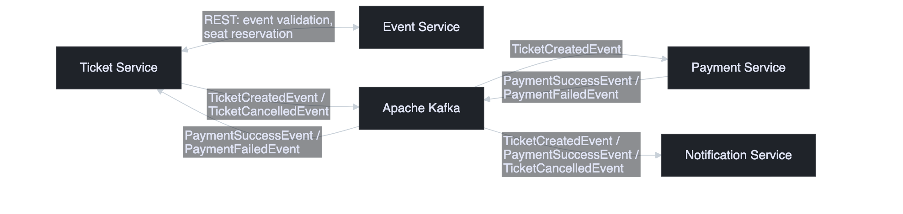
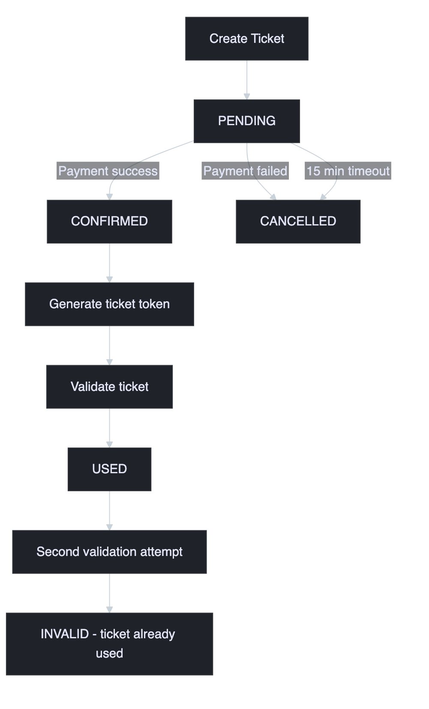
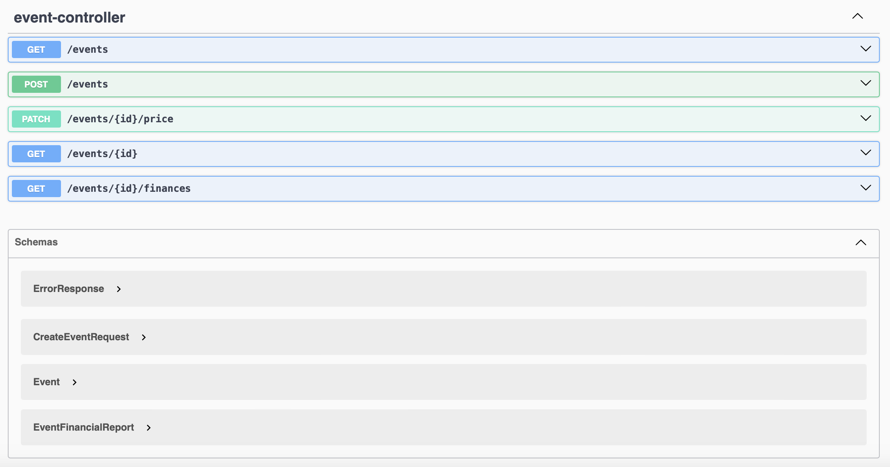
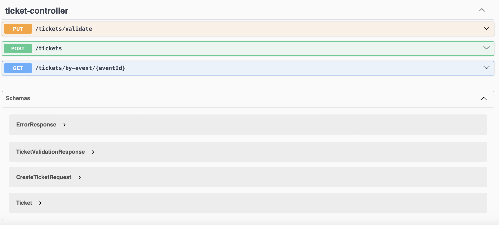

# 🎟️ ESN Events Platform

A microservices-based event management and ticketing platform built with Spring Boot, Apache Kafka and Docker

---

## 📑 Table of Contents

- [📝 Description](#description)
    - [Overview](#overview)
    - [Key Features](#features)
- [🏗️ Architecture](#architecture)
- [🎯 Business Workflow](#workflow)
- [🔧 Technologies](#technologies)
- [📡 API Endpoints](#endpoints)
- [📸 Screenshots](#screenshots)
- [✅ Testing](#testing)
- [🐳 Docker Setup](#docker)
- [🚀 How to Run](#run)
- [📋 Future Improvements](#todo)

---

# <a name="description"></a> 📝 Description

## <a name="overview"></a> Overview

ESN Events Platform is a microservices-based event management and ticketing system inspired by the needs of student organisations such as Erasmus Student Network (ESN).

The platform allows organisers to create events, manage ticket reservations, process payments and notify participants about important updates.

The main goal of this project was to gain hands-on experience with:

- Microservices architecture
- Event-driven communication
- Apache Kafka
- Business workflow modelling

Communication between services is performed asynchronously using Kafka, allowing services to remain loosely coupled and independently deployable.

---

## <a name="features"></a> ✨ Key Features

### 🎉 Event Management

- Create free and paid events
- Configure event capacity
- Update event prices
- Generate financial reports
- Prevent overbooking using optimistic locking

### 🎫 Ticket Management

- Reserve seats for participants
- Automatic reservation expiration after 15 minutes if payment is not completed
- Generate unique ticket tokens after successful payment
- Validate tickets during event entry
- Prevent duplicate ticket usage

### 💳 Payment Processing

- Asynchronous payment workflow using Kafka
- Event-based communication between services
- Ready for future payment provider integration
- Payment confirmation and cancellation flows

### 🔔 Notifications

- Reservation confirmation notifications
- Payment success notifications
- Event-driven notification delivery

---

# <a name="architecture"></a> 🏗️ Architecture

The platform consists of four independent Spring Boot microservices:

| Service | Responsibility |
|----------|----------|
| Event Service | Event management and financial reporting |
| Ticket Service | Ticket lifecycle management |
| Payment Service | Payment processing workflow |
| Notification Service | Sending participant notifications |

---

# <a name="workflow"></a> 🎯 Business Workflow

The following workflow demonstrates the complete ticket lifecycle:

```text
Create Ticket
      |
      v
PENDING
      |
      +----------------+
      |                |
      v                v

Payment OK      Payment Failed

      |                |
      v                v

CONFIRMED      CANCELLED

      |
      v

QR Validation

      |
      v

USED
```

### Reservation Timeout

A scheduled job automatically checks for unpaid reservations.

```text
Ticket Created
      |
      v

PENDING (15 min)

      |
      v

Reservation Timeout

      |
      v

CANCELLED
```

This prevents seats from being blocked indefinitely.

---

# <a name="technologies"></a> 🔧 Technologies
### 🚀 Backend

- Java 21
- Spring Boot
- Spring Data JPA
- Hibernate
- Apache Kafka
- PostgreSQL
- Docker
- JUnit 5
- Mockito
- Maven


---

# <a name="endpoints"></a> 📡 API Endpoints

## Event Service

| Method | Endpoint | Description |
|----------|----------|----------|
| POST | `/events` | Create event |
| GET | `/events` | Get all events |
| GET | `/events/{id}` | Get event by ID |
| GET | `/events/{id}/finances` | Financial report |
| PATCH | `/events/{id}/price` | Update event price |

---

## Ticket Service

| Method | Endpoint | Description |
|----------|----------|----------|
| POST | `/tickets` | Create ticket |
| GET | `/tickets/by-event/{eventId}` | Get tickets by event |
| PUT | `/tickets/validate` | Validate ticket |

---

## Payment Service

Payment processing is currently triggered via Kafka events.

```text
TicketCreatedEvent
        ↓
Payment Service
        ↓
PaymentSuccessEvent / PaymentFailedEvent
```

> Note: Payments are currently mocked for demonstration purposes. In a production environment this service would integrate with a real payment provider such as Stripe or PayPal.

---

## Notification Service

Consumes Kafka events:

```text
ticket-created-topic

payment-success-topic

ticket-cancelled-topic
```

and sends corresponding notifications.

---

# <a name="screenshots"></a> 📸 Screenshots

## 🏗️ Architecture Diagram



---

## 🎯 Ticket Lifecycle Workflow



---

## 📡 Swagger - Event Service



---

## 🎫 Swagger - Ticket Service



---

# <a name="testing"></a> ✅ Testing

The project contains unit tests written with JUnit 5 & Mockito

Current test coverage includes:

### Event Service

- Event creation
- Seat reservation
- Capacity validation
- Financial reporting

### Ticket Service

- Ticket creation
- Ticket confirmation
- Ticket cancellation
- Ticket validation
- Reservation expiration scheduler

### Notification Service

- Kafka consumer processing
- Notification delivery flow

### Payment Service

- Payment event processing
- Kafka producer verification

---

# <a name="docker"></a> 🐳 Docker Setup

The project is designed to run using Docker containers.

Infrastructure services:

```text
PostgreSQL
Apache Kafka
```

Application services:

```text
event-service
ticket-service
payment-service
notification-service
```

---

# <a name="run"></a> 🚀 How to Run

## 1. Clone Repository

```bash
git clone https://github.com/patryk47853/ESN-Events-Platform
```

---

## 2. Start Infrastructure

```bash
docker-compose up -d
```

This will start:

```text
PostgreSQL
Kafka
```

---

## 3. Run Microservices

Start each service separately:

```bash
mvn spring-boot:run
```

for:

```text
event-service
ticket-service
payment-service
notification-service
```

---

## 4. Service Ports

| Service | Port |
|----------|----------|
| Event Service | 8081 |
| Ticket Service | 8082 |
| Notification Service | 8083 |
| Payment Service | 8084 |

---

## 5. Business Flow

1. Create an event
2. Client buys the ticket
3. Ticket status becomes `PENDING`
4. Payment Service receives Kafka event
5. Ticket becomes `CONFIRMED`
6. QR token is generated
7. Ticket can be validated at event entrance

---

# <a name="todo"></a> 📋 Future Improvements

- [ ] Kubernetes deployment
- [ ] JWT authentication and authorization
- [ ] API Gateway
- [ ] Service Discovery
- [ ] SMTP email integration
- [ ] Real payment provider integration
- [ ] Centralized logging
- [ ] Monitoring and observability
- [ ] CI/CD pipeline
- [ ] Integration tests

---