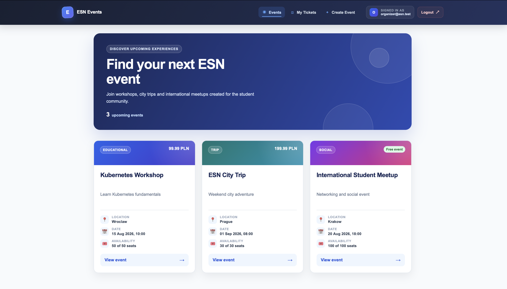
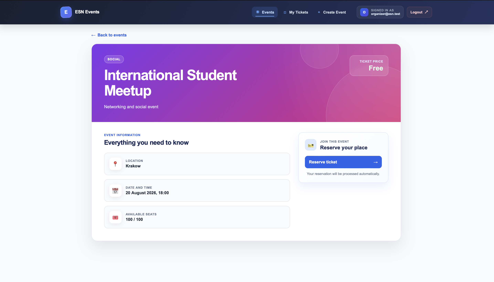
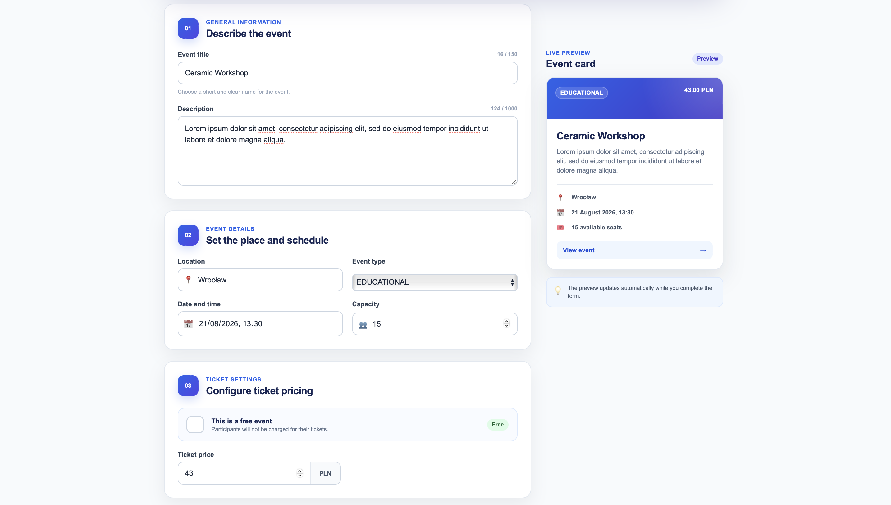
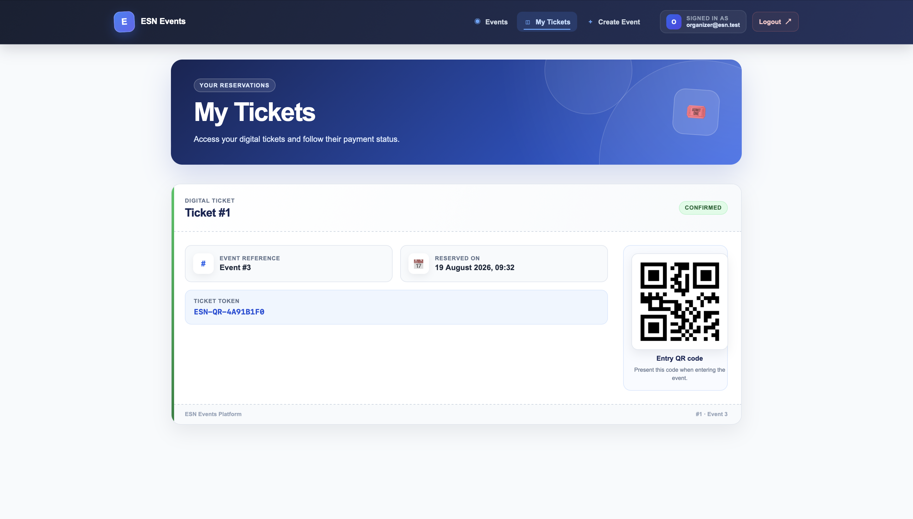
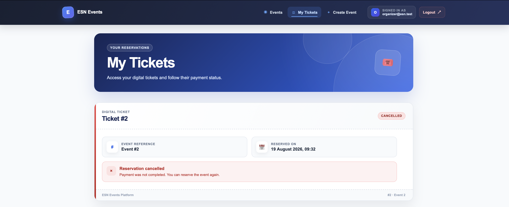
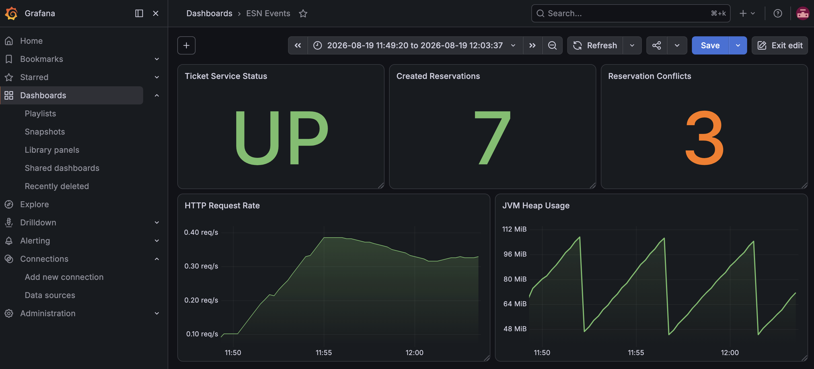

# 🎟️ ESN Events Platform

A Kubernetes-deployed, event-driven microservices platform built with Spring Boot, Apache Kafka, PostgreSQL and Docker.

---

## 📑 Table of Contents

- [📝 Description](#description)
    - [Overview](#overview)
    - [Key Features](#features)
- [🏗️ Architecture](#architecture)
- [🎯 Business Workflow](#workflow)
- [🔧 Technologies](#technologies)
- [📡 API Endpoints](#endpoints)
- [📸 Screenshots](#screenshots)
- [✅ Testing](#testing)
- [🐳 Docker Setup](#docker)
- [🚀 How to Run](#run)
- [📋 Future Improvements](#todo)

---

# <a name="description"></a> 📝 Description

## <a name="overview"></a> Overview

ESN Events Platform is a microservices-based event management and ticketing system inspired by the needs of student organisations such as Erasmus Student Network (ESN).

The platform allows organisers to create events, manage ticket reservations, process payments and notify participants about important updates.

The main goal of this project was to gain hands-on experience with:

- Microservices architecture
- Event-driven communication
- Apache Kafka
- Kubernetes deployments
- JWT-based authentication and role-based authorisation
- REST API design
- Integration testing with Testcontainers
- Business workflow modelling

The platform demonstrates both synchronous REST communication and asynchronous event-driven communication through Apache Kafka.

All application and infrastructure components can be deployed to Kubernetes using Deployments, Services, ConfigMaps and Secrets. Authentication is handled by a dedicated Auth Service that issues signed JWT access tokens.

---

## <a name="features"></a> ✨ Key Features

### 🎉 Event Management

- Create free and paid events
- Configure event capacity
- Update event prices
- Generate financial reports
- Prevent overbooking using optimistic locking

### 🎫 Ticket Management

- Reserve seats for participants
- Automatic reservation expiration after 15 minutes if payment is not completed
- Generate unique ticket tokens after successful payment
- Validate tickets during event entry
- Prevent duplicate ticket usage

### 💳 Payment Processing

- Asynchronous payment workflow using Kafka
- Event-based communication between services
- Ready for future payment provider integration
- Payment confirmation and cancellation flows

### 🔔 Notifications

- Reservation confirmation notifications
- Payment success notifications
- Event-driven notification delivery

### 🔐 Authentication and Authorisation

- Dedicated Auth Service
- User registration and login
- Password hashing with BCrypt
- Signed JWT access tokens
- Stateless Bearer token authentication
- Role-based access control
- Support for `USER`, `ORGANIZER` and `ADMIN` roles
- Protected Event Service and Ticket Service endpoints
- Kubernetes Secrets for JWT and database credentials

---

# <a name="architecture"></a> 🏗️ Architecture

The platform consists of five independent Spring Boot microservices:

| Service | Responsibility |
|----------|----------------|
| Auth Service | User registration, authentication, JWT generation and role management |
| Event Service | Event management, seat availability and financial reporting |
| Ticket Service | Ticket lifecycle management, reservation and validation |
| Payment Service | Asynchronous payment processing workflow |
| Notification Service | Sending simulated participant notifications |


The following workflow demonstrates the complete ticket lifecycle:

```text
Create Ticket
      |
      v
PENDING
      |
      +----------------+
      |                |
      v                v

Payment OK      Payment Failed

      |                |
      v                v

CONFIRMED      CANCELLED

      |
      v

QR Validation

      |
      v

USED
```

### Reservation Timeout

A scheduled job automatically checks for unpaid reservations.

```text
Ticket Created
      |
      v

PENDING (15 min)

      |
      v

Reservation Timeout

      |
      v

CANCELLED
```

This prevents seats from being blocked indefinitely.

---

# <a name="technologies"></a> 🔧 Technologies

## 🚀 Backend

- Java 21
- Spring Boot
- Spring Data JPA
- Hibernate
- Spring Security 
- OAuth2

## 📨 Event Streaming

- Apache Kafka

## 🗄️ Database

- PostgreSQL

## ☸️ Infrastructure

- Docker
- Kubernetes

## 🧪 Testing

- JUnit 5
- Mockito
- Testcontainers
- PostgreSQL integration test
- Automated Bash smoke testing

## 🛠️ Build Tools

- Maven

---

# <a name="endpoints"></a> 📡 API Endpoints

## Auth Service

| Method | Endpoint | Access | Description |
|----------|----------|----------|----------|
| POST | `/auth/register` | Public | Register a new user with the `USER` role |
| POST | `/auth/login` | Public | Authenticate and receive a signed JWT access token |
| GET | `/auth/me` | Authenticated | Get information about the authenticated user |

---

## Event Service

| Method | Endpoint | Access | Description |
|----------|----------|----------|----------|
| POST | `/api/events` | `ORGANIZER`, `ADMIN` | Create an event |
| GET | `/api/events` | Public | Get all events |
| GET | `/api/events/{id}` | Public | Get event by ID |
| GET | `/api/events/{id}/finances` | Authenticated | Generate a financial report |
| PATCH | `/api/events/{id}/price` | `ORGANIZER`, `ADMIN` | Update event price |
| PUT | `/api/events/{id}/reserve` | Internal | Reserve a seat |
| PUT | `/api/events/{id}/release` | Internal | Release a seat |

---

## Ticket Service

| Method | Endpoint | Access | Description |
|----------|----------|----------|----------|
| POST | `/tickets` | Authenticated | Create a ticket reservation |
| GET | `/tickets/by-event/{eventId}` | `ORGANIZER`, `ADMIN` | Get tickets assigned to an event |
| PUT | `/tickets/validate` | `ORGANIZER`, `ADMIN` | Validate a ticket token |

---

## Payment Service

Payment processing is currently triggered via Kafka events.

```text
TicketCreatedEvent
        ↓
Payment Service
        ↓
PaymentSuccessEvent / PaymentFailedEvent
```

> Note: Payments are currently mocked for demonstration purposes. In a production environment this service would integrate with a real payment provider such as Stripe or PayPal.

---

## Notification Service

Consumes Kafka events:

```text
ticket-created-topic

payment-success-topic

ticket-cancelled-topic
```

and sends corresponding notifications.

---
# <a name="screenshots"></a> 📸 Screenshots

## 🏗️ Architecture Diagram


---

## 🏠 Main Page



---

## 🎟️ Event Details



---

## 📊 Organizer Panel



---

## 🎟️ Ticket Status (Confirmed & Cancelled)



<br>



---

## 📈 Grafana Monitoring



---

# <a name="testing"></a> ✅ Testing

The project includes unit, integration and automated smoke tests.

## Unit Testing

Unit tests are written with JUnit 5 and Mockito.

### Event Service

- Event creation
- Seat reservation
- Capacity validation
- Financial reporting

### Ticket Service

- Ticket creation
- Ticket confirmation
- Ticket cancellation
- Ticket validation
- Reservation expiration scheduler

### Notification Service

- Kafka consumer processing
- Notification delivery flow

### Payment Service

- Payment event processing
- Kafka producer verification

### Auth Service

- User registration
- Email normalisation
- Duplicate email rejection
- Password encoding with BCrypt
- User authentication
- Invalid credentials handling
- JWT generation and validation
- Modified JWT rejection

## Integration Testing

Auth Service includes integration tests using:

- Spring Boot Test
- MockMvc
- Spring Security
- Testcontainers
- PostgreSQL

The integration tests start a real PostgreSQL container and verify the complete authentication flow:

```text
User Registration
        |
        v
BCrypt Password Hashing
        |
        v
JWT Generation
        |
        v
Bearer Token Authentication
        |
        v
Protected Endpoint Access
```

The integration test suite also verifies:

- Requests without a token return `401 Unauthorized`
- Invalid JWT tokens are rejected
- Incorrect login credentials return `401 Unauthorized`
- Authenticated users can access protected endpoints
- Registered users receive the `USER` role

## Automated Kubernetes Smoke Test

The project includes a Bash-based end-to-end smoke test for the local Kubernetes deployment.

The script verifies:

- Kubernetes deployment availability
- Service health endpoints
- Auth Service registration and login
- JWT Bearer authentication
- `USER` role restrictions
- `ORGANIZER` role permissions
- Event creation
- Ticket creation
- REST communication between microservices
- Asynchronous Kafka payment processing
- Final ticket state after payment processing

Run the smoke test from the project root:

```bash
./scripts/smoke-test.sh
```

The script provides a clear pass/fail result and automatically manages the required Kubernetes port-forward processes.

> **Note:** This script was developed with AI assistance, manually reviewed and adapted to the project. It was added as a learning exercise to automate verification of the Kubernetes deployment and the core event-driven workflow.

---

# <a name="docker"></a> 🐳 Docker Setup

The project is designed to run using Docker containers.

Infrastructure services:

```text
PostgreSQL
Apache Kafka
```

Application services:

```text
event-service
ticket-service
payment-service
notification-service
```

---

# <a name="run"></a> 🚀 How to Run

The project supports two deployment options:

- Docker Compose for local development
- Kubernetes for running the complete platform

---

## 🐳 Option 1 - Docker Compose

### 1. Clone the Repository

```bash
git clone https://github.com/patryk47853/ESN-Events-Platform
cd ESN-Events-Platform
```

### 2. Start the Infrastructure

```bash
docker-compose up -d
```

This starts:

```text
PostgreSQL
Apache Kafka
```

### 3. Run the Microservices

Build the complete project from the project root:

```bash
mvn clean package
```

Start each service separately:

```bash
cd auth-service
mvn spring-boot:run
```

```bash
cd event-service
mvn spring-boot:run
```

```bash
cd ticket-service
mvn spring-boot:run
```

```bash
cd payment-service
mvn spring-boot:run
```

```bash
cd notification-service
mvn spring-boot:run
```

---

## ☸️ Option 2 - Kubernetes Deployment

### 1. Build the Project

Run the following command from the project root:

```bash
mvn clean package
```

### 2. Build the Docker Images

```bash
docker build -t esn-auth-service:0.1 auth-service
docker build -t esn-event-service:0.2 event-service
docker build -t esn-ticket-service:0.2 ticket-service
docker build -t esn-payment-service:0.1 payment-service
docker build -t esn-notification-service:0.1 notification-service
```

### 3. Create the Kubernetes Namespace

```bash
kubectl apply -f k8s/namespace.yaml
```

### 4. Create the Required Kubernetes Secrets

Generate a JWT signing key:

```bash
JWT_SECRET=$(openssl rand -base64 32)
```

Create the Auth Service Secret:

```bash
kubectl create secret generic auth-service-secret \
  --namespace esn-events \
  --from-literal=JWT_SECRET="$JWT_SECRET" \
  --from-literal=SPRING_DATASOURCE_PASSWORD=postgres
```

Create the shared JWT Secret used by Event Service and Ticket Service:

```bash
kubectl create secret generic jwt-shared-secret \
  --namespace esn-events \
  --from-literal=JWT_SECRET="$JWT_SECRET"
```

> Kubernetes Secrets containing credentials and JWT signing keys are not committed to the repository.

### 5. Deploy the Infrastructure

```bash
kubectl apply -f k8s/postgres
kubectl apply -f k8s/kafka
```

### 6. Deploy the Microservices

```bash
kubectl apply -f k8s/auth-service
kubectl apply -f k8s/event-service
kubectl apply -f k8s/ticket-service
kubectl apply -f k8s/payment-service
```

If Notification Service is included in the current Kubernetes setup:

```bash
kubectl apply -f k8s/notification-service
```

### 7. Verify the Deployment

```bash
kubectl get pods -n esn-events
```

Expected result:

```text
auth-service          1/1   Running
event-service         1/1   Running
ticket-service        1/1   Running
payment-service       1/1   Running
postgres              1/1   Running
kafka                 1/1   Running
```

If Notification Service is deployed, the following pod should also be available:

```text
notification-service  1/1   Running
```

### 8. Run the Automated Smoke Test

The smoke test verifies authentication, authorisation, REST communication and Kafka-based payment processing in the deployed Kubernetes environment.

```bash
./scripts/smoke-test.sh
```

---

## Service Ports

| Service | Port |
|----------|------|
| Event Service | 8081 |
| Ticket Service | 8082 |
| Notification Service | 8083 |
| Payment Service | 8084 |
| Auth Service | 8085 |

---

## Example Event-Driven Workflow

```text
Client
  │
  ▼
Ticket Service
  │
  ▼
TicketCreatedEvent
  │
  ▼
Apache Kafka
  │
  ▼
Payment Service
  │
  ├── PaymentSuccessEvent
  │
  └── PaymentFailedEvent
         │
         ▼
Apache Kafka
         │
         ▼
Ticket Service
         │
         ▼
CONFIRMED / CANCELLED
```

Business flow:

1. Create an event
2. Create a ticket reservation
3. Ticket status becomes `PENDING`
4. `TicketCreatedEvent` is published to Kafka
5. Payment Service processes the event
6. Payment Service publishes:
    - `PaymentSuccessEvent`
    - `PaymentFailedEvent`
7. Ticket Service updates ticket status:
    - `CONFIRMED`
    - `CANCELLED`
8. Confirmed tickets receive unique ticket tokens
9. Tickets can be validated during event entry

---

# <a name="todo"></a> 📋 Project Roadmap & Future Improvements

This section tracks the current state of the project and planned improvements.  
The project is developed incrementally, with each version introducing a specific backend, infrastructure or documentation improvement.

---

## ✅ Completed Versions

### v0.1 - Initial Backend Setup

- Created initial microservices structure.
- Added basic Spring Boot services:
    - Event Service
    - Ticket Service
    - Payment Service
    - Notification Service
- Configured PostgreSQL database connection.
- Added basic REST endpoints for event and ticket management.

---

### v0.2 - Event and Ticket Business Logic

- Implemented event creation and event listing.
- Added support for free and paid events.
- Implemented ticket reservation flow.
- Added ticket statuses:
    - `PENDING`
    - `CONFIRMED`
    - `CANCELLED`
- Added financial report endpoint for events.
- Added optimistic locking for safer concurrent updates.

---

### v0.3 - Kafka-Based Communication

- Added Apache Kafka integration between services.
- Implemented event-driven communication using:
    - `TicketCreatedEvent`
    - `PaymentSuccessEvent`
    - `PaymentFailedEvent`
    - `TicketCancelledEvent`
- Payment Service reacts to created tickets.
- Ticket Service reacts to payment results.
- Notification Service consumes events and sends simulated notifications.

---

### v0.4 - Ticket Lifecycle Improvements

- Added automatic cancellation of unpaid reservations after 15 minutes.
- Added scheduled job for expired pending tickets.
- Added ticket token generation after successful payment.
- Added ticket validation flow.
- Prevented duplicate ticket usage after successful validation.

---

### v0.5 - Testing and API Documentation

- Added unit tests for core business logic.
- Covered selected service-layer workflows using JUnit 5 and Mockito.
- Added Swagger/OpenAPI documentation for REST APIs.
- Added README sections describing architecture, workflow and endpoints.

---
### v0.6 - Kubernetes Deployment

- Added a dedicated Kubernetes namespace.
- Added Deployments for the application services.
- Added Kubernetes Services for internal communication.
- Added ConfigMaps for runtime configuration.
- Added Kubernetes Secrets for sensitive configuration.
- Deployed Apache Kafka in KRaft mode.
- Deployed PostgreSQL.
- Configured readiness and liveness probes.
- Added resource requests and limits.
- Added service discovery using Kubernetes DNS.
- Externalised application configuration using environment variables.

---

### v0.7 - Security Layer

- Added a dedicated Auth Service.
- Added user registration and login endpoints.
- Added BCrypt password hashing.
- Added signed JWT access tokens.
- Added stateless Bearer token authentication.
- Added `USER`, `ORGANIZER` and `ADMIN` roles.
- Added role-based access control.
- Protected selected Event Service and Ticket Service endpoints.
- Added Kubernetes Secrets for JWT signing keys and database credentials.
- Added unit tests for authentication and JWT logic.
- Added integration tests using MockMvc, Testcontainers and PostgreSQL.
- Deployed Auth Service to Kubernetes.
- Added an automated Kubernetes smoke test covering authentication, authorisation, REST communication and Kafka processing.

---

## 🚧 Planned Improvements

### v0.8 - API Gateway

- [ ] Add Spring Cloud Gateway as a single entry point.
- [ ] Route requests to Auth, Event and Ticket Services.
- [ ] Forward JWT Bearer tokens to protected services.
- [ ] Expose the platform through one local endpoint.
- [ ] Configure CORS for the Angular frontend.

---

### v0.9 - Angular Frontend MVP

- [ ] Create an Angular application using standalone components.
- [ ] Add routing and a shared application layout.
- [ ] Add registration and login forms.
- [ ] Add JWT storage and an HTTP authentication interceptor.
- [ ] Add protected routes with authentication and role guards.
- [ ] Add event listing and event details views.
- [ ] Add ticket reservation and user ticket views.
- [ ] Add organiser functionality for creating events.
- [ ] Integrate the frontend with API Gateway.
- [ ] Containerise and deploy the frontend to Kubernetes.

---

### v1.0 - Notification and Reliability Improvements

- [ ] Complete and deploy Notification Service.
- [ ] Add Kafka retry and Dead Letter Topic handling.
- [ ] Improve consumer idempotency.
- [ ] Add monitoring, metrics and centralised logging.
- [ ] Add CI/CD pipelines.